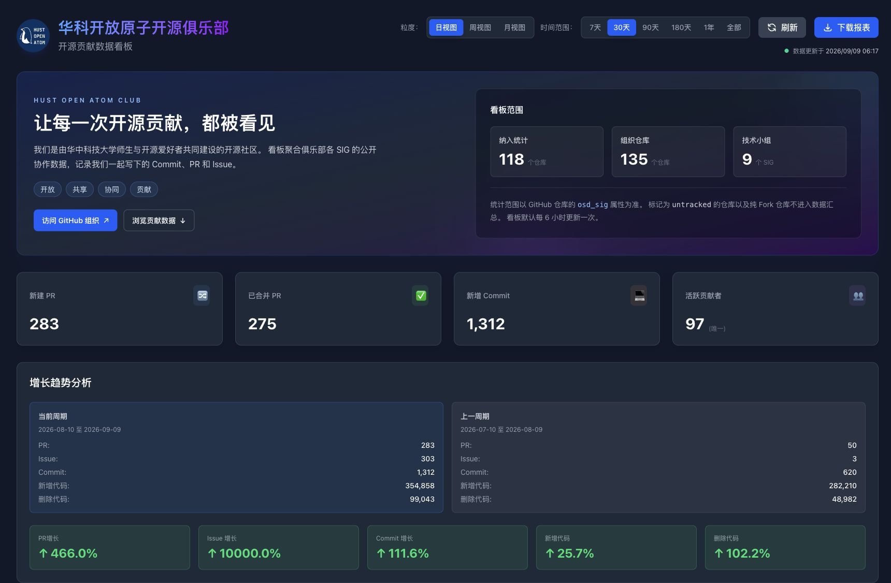
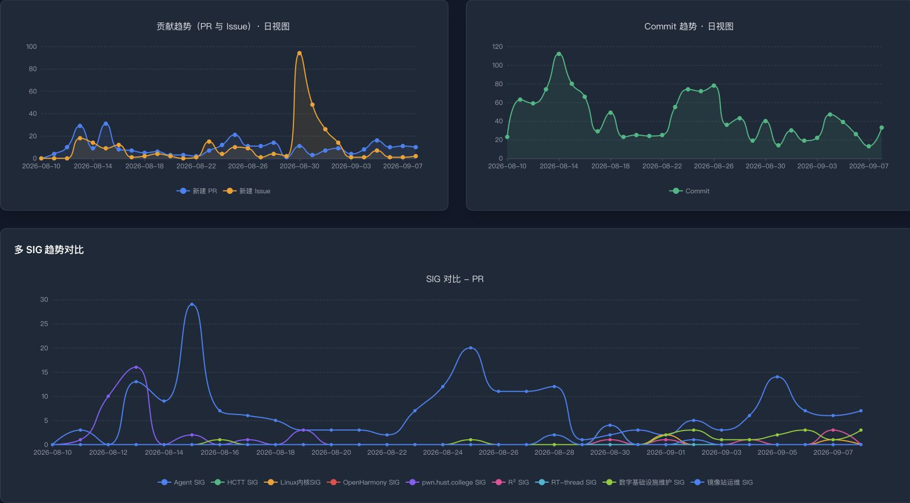
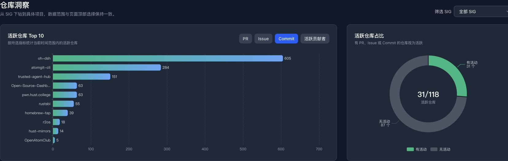
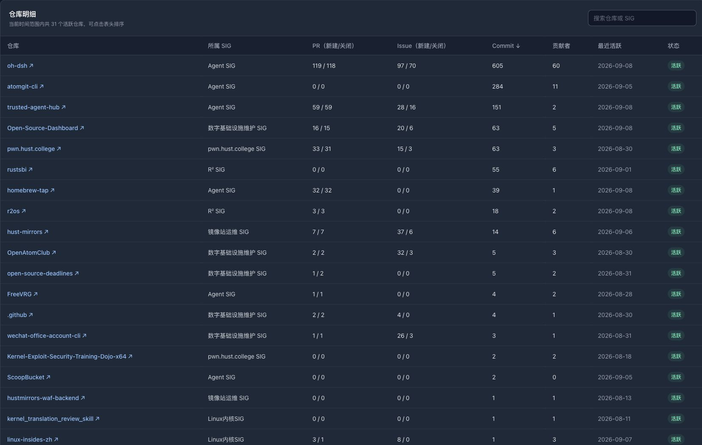
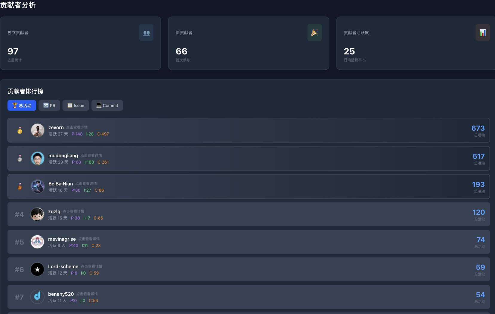

# 界面导览

[文档首页](README.md) · [快速开始](getting-started.md) · [架构与数据口径](architecture.md) · [API 参考](api.md) · [运行与维护](operations.md)

以下截图来自线上部署的实际页面，使用“日视图 / 30 天”筛选。活动数量和数据更新时间会随采集任务继续变化。

## 组织概览与增长分析

顶部提供统计粒度、时间范围、刷新和报表下载入口，并展示看板覆盖范围、组织活动摘要与相邻周期增长对比。

## 活动趋势与 SIG 对比

组织趋势分别展示 PR/Issue 和 Commit 活动，多 SIG 图用于比较不同技术小组在同一指标下的变化。

## 仓库洞察

仓库洞察支持按 SIG 筛选和切换排行指标，并同时展示活跃仓库 Top 10 与活跃仓库占比。

## 仓库明细

仓库表格汇总 PR、Issue、Commit、贡献者、最近活跃日期和状态，支持搜索与按列排序。

## 贡献者分析

贡献者区域展示独立贡献者、新贡献者、活跃度和排行榜，可按总活动、PR、Issue 或 Commit 排序。

